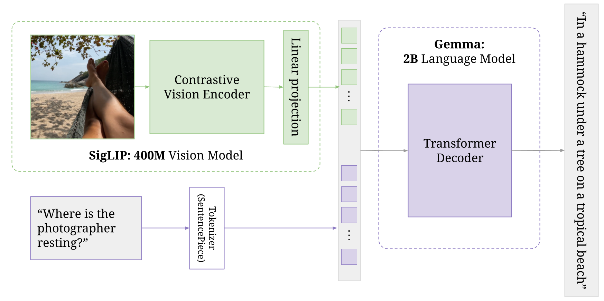

## Implementation of Paligemma (WIP)

Implementation of Vision Language Model (paligemma). 




## Citations

```bibtex
@misc{beyer2024paligemmaversatile3bvlm,
      title={PaliGemma: A versatile 3B VLM for transfer}, 
      author={Lucas Beyer and Andreas Steiner and André Susano Pinto and Alexander Kolesnikov and Xiao Wang and Daniel Salz and Maxim Neumann and Ibrahim Alabdulmohsin and Michael Tschannen and Emanuele Bugliarello and Thomas Unterthiner and Daniel Keysers and Skanda Koppula and Fangyu Liu and Adam Grycner and Alexey Gritsenko and Neil Houlsby and Manoj Kumar and Keran Rong and Julian Eisenschlos and Rishabh Kabra and Matthias Bauer and Matko Bošnjak and Xi Chen and Matthias Minderer and Paul Voigtlaender and Ioana Bica and Ivana Balazevic and Joan Puigcerver and Pinelopi Papalampidi and Olivier Henaff and Xi Xiong and Radu Soricut and Jeremiah Harmsen and Xiaohua Zhai},
      year={2024},
      eprint={2407.07726},
      archivePrefix={arXiv},
      primaryClass={cs.CV},
      url={https://arxiv.org/abs/2407.07726}, 
}
```
```bibtex
@misc{zhai2023sigmoidlosslanguageimage,
      title={Sigmoid Loss for Language Image Pre-Training}, 
      author={Xiaohua Zhai and Basil Mustafa and Alexander Kolesnikov and Lucas Beyer},
      year={2023},
      eprint={2303.15343},
      archivePrefix={arXiv},
      primaryClass={cs.CV},
      url={https://arxiv.org/abs/2303.15343}, 
}
```
```bibtex
@misc{vaswani2023attentionneed,
      title={Attention Is All You Need}, 
      author={Ashish Vaswani and Noam Shazeer and Niki Parmar and Jakob Uszkoreit and Llion Jones and Aidan N. Gomez and Lukasz Kaiser and Illia Polosukhin},
      year={2023},
      eprint={1706.03762},
      archivePrefix={arXiv},
      primaryClass={cs.CL},
      url={https://arxiv.org/abs/1706.03762}, 
}
```
```bibtex
@misc{dosovitskiy2021imageworth16x16words,
      title={An Image is Worth 16x16 Words: Transformers for Image Recognition at Scale}, 
      author={Alexey Dosovitskiy and Lucas Beyer and Alexander Kolesnikov and Dirk Weissenborn and Xiaohua Zhai and Thomas Unterthiner and Mostafa Dehghani and Matthias Minderer and Georg Heigold and Sylvain Gelly and Jakob Uszkoreit and Neil Houlsby},
      year={2021},
      eprint={2010.11929},
      archivePrefix={arXiv},
      primaryClass={cs.CV},
      url={https://arxiv.org/abs/2010.11929}, 
}
```