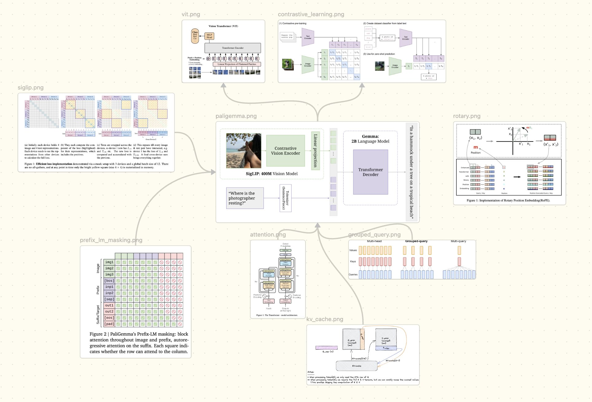

## Implementation of Paligemma

Implementation of Vision Language Model (paligemma). 




## Getting Started

### Environment setup

Use **conda** or **uv** to install dependencies:

```bash
# with conda
conda env create -f environment.yml
conda activate paligemma

# with uv
pip install uv
uv venv
uv pip install -r requirements.txt
```

### MPS Backend Support (Apple Silicon)

This implementation includes full support for Apple's Metal Performance Shaders (MPS) backend, enabling GPU acceleration on Mac devices with Apple Silicon (M1, M2, M3, etc.).

#### Features

- **Automatic device detection**: Automatically detects and uses MPS when available
- **Optimized memory management**: Configures MPS memory settings for optimal performance
- **Dtype compatibility**: Automatically converts unsupported dtypes (e.g., float64 to float32)
- **Fallback support**: Enables CPU fallback for operations not yet supported by MPS
- **Performance optimizations**: MPS-specific optimizations for better inference speed

#### Testing MPS Support

To verify MPS is working correctly on your system:

```bash
# Run the MPS test script
python test_mps_support.py
```

This will run comprehensive tests including:
- MPS availability checks
- Tensor operations compatibility
- Model inference tests
- Performance benchmarks

#### Running Inference with MPS

The inference script automatically detects and uses MPS when available:

```bash
# Standard inference (auto-detects MPS)
bash launch_inference.sh

# Or use the MPS-optimized launch script
bash launch_inference_mps.sh
```

#### MPS Configuration

You can configure MPS behavior through environment variables:

```bash
# Set memory usage limit (default: 0.7 = 70%)
export PYTORCH_MPS_HIGH_WATERMARK_RATIO=0.7

# Enable CPU fallback for unsupported ops (recommended)
export PYTORCH_ENABLE_MPS_FALLBACK=1

# Enable profiling for debugging (default: 0)
export PYTORCH_MPS_PROFILING=0
```

#### Troubleshooting MPS

If you encounter issues with MPS:

1. **Verify PyTorch MPS support**:
   ```python
   import torch
   print(torch.backends.mps.is_available())  # Should return True
   print(torch.backends.mps.is_built())      # Should return True
   ```

2. **Check macOS version**: MPS requires macOS 12.3+ 

3. **Update PyTorch**: Ensure you have a recent PyTorch version with MPS support:
   ```bash
   pip install torch>=2.0.0
   ```

4. **Memory issues**: If you encounter out-of-memory errors, reduce the memory fraction:
   ```bash
   export PYTORCH_MPS_HIGH_WATERMARK_RATIO=0.5
   ```

### Download model weights

The weights are hosted on [Hugging Face](https://huggingface.co/google/paligemma-3b-pt-224). Download them with:

```bash
git lfs install
git clone https://huggingface.co/google/paligemma-3b-pt-224 ~/workspace/model_weights/paligemma-3b-pt-224
```

Set `MODEL_PATH` in `launch_inference.sh` to the downloaded directory.


## Citations

```bibtex
@misc{beyer2024paligemmaversatile3bvlm,
      title={PaliGemma: A versatile 3B VLM for transfer}, 
      author={Lucas Beyer and Andreas Steiner and André Susano Pinto and Alexander Kolesnikov and Xiao Wang and Daniel Salz and Maxim Neumann and Ibrahim Alabdulmohsin and Michael Tschannen and Emanuele Bugliarello and Thomas Unterthiner and Daniel Keysers and Skanda Koppula and Fangyu Liu and Adam Grycner and Alexey Gritsenko and Neil Houlsby and Manoj Kumar and Keran Rong and Julian Eisenschlos and Rishabh Kabra and Matthias Bauer and Matko Bošnjak and Xi Chen and Matthias Minderer and Paul Voigtlaender and Ioana Bica and Ivana Balazevic and Joan Puigcerver and Pinelopi Papalampidi and Olivier Henaff and Xi Xiong and Radu Soricut and Jeremiah Harmsen and Xiaohua Zhai},
      year={2024},
      eprint={2407.07726},
      archivePrefix={arXiv},
      primaryClass={cs.CV},
      url={https://arxiv.org/abs/2407.07726}, 
}
```
```bibtex
@misc{zhai2023sigmoidlosslanguageimage,
      title={Sigmoid Loss for Language Image Pre-Training}, 
      author={Xiaohua Zhai and Basil Mustafa and Alexander Kolesnikov and Lucas Beyer},
      year={2023},
      eprint={2303.15343},
      archivePrefix={arXiv},
      primaryClass={cs.CV},
      url={https://arxiv.org/abs/2303.15343}, 
}
```
```bibtex
@misc{vaswani2023attentionneed,
      title={Attention Is All You Need}, 
      author={Ashish Vaswani and Noam Shazeer and Niki Parmar and Jakob Uszkoreit and Llion Jones and Aidan N. Gomez and Lukasz Kaiser and Illia Polosukhin},
      year={2023},
      eprint={1706.03762},
      archivePrefix={arXiv},
      primaryClass={cs.CL},
      url={https://arxiv.org/abs/1706.03762}, 
}
```
```bibtex
@misc{dosovitskiy2021imageworth16x16words,
      title={An Image is Worth 16x16 Words: Transformers for Image Recognition at Scale}, 
      author={Alexey Dosovitskiy and Lucas Beyer and Alexander Kolesnikov and Dirk Weissenborn and Xiaohua Zhai and Thomas Unterthiner and Mostafa Dehghani and Matthias Minderer and Georg Heigold and Sylvain Gelly and Jakob Uszkoreit and Neil Houlsby},
      year={2021},
      eprint={2010.11929},
      archivePrefix={arXiv},
      primaryClass={cs.CV},
      url={https://arxiv.org/abs/2010.11929}, 
}
```

```bibtex
@misc{zhang2019rootmeansquarelayer,
      title={Root Mean Square Layer Normalization}, 
      author={Biao Zhang and Rico Sennrich},
      year={2019},
      eprint={1910.07467},
      archivePrefix={arXiv},
      primaryClass={cs.LG},
      url={https://arxiv.org/abs/1910.07467}, 
}
```

```bibtex
@misc{ba2016layernormalization,
      title={Layer Normalization}, 
      author={Jimmy Lei Ba and Jamie Ryan Kiros and Geoffrey E. Hinton},
      year={2016},
      eprint={1607.06450},
      archivePrefix={arXiv},
      primaryClass={stat.ML},
      url={https://arxiv.org/abs/1607.06450}, 
}
```

```bibtex
@misc{shazeer2019fasttransformerdecodingwritehead,
      title={Fast Transformer Decoding: One Write-Head is All You Need}, 
      author={Noam Shazeer},
      year={2019},
      eprint={1911.02150},
      archivePrefix={arXiv},
      primaryClass={cs.NE},
      url={https://arxiv.org/abs/1911.02150}, 
}
```


```bibtex
@misc{ainslie2023gqatraininggeneralizedmultiquery,
      title={GQA: Training Generalized Multi-Query Transformer Models from Multi-Head Checkpoints}, 
      author={Joshua Ainslie and James Lee-Thorp and Michiel de Jong and Yury Zemlyanskiy and Federico Lebrón and Sumit Sanghai},
      year={2023},
      eprint={2305.13245},
      archivePrefix={arXiv},
      primaryClass={cs.CL},
      url={https://arxiv.org/abs/2305.13245}, 
}
```

```bibtex
@misc{su2023roformerenhancedtransformerrotary,
      title={RoFormer: Enhanced Transformer with Rotary Position Embedding}, 
      author={Jianlin Su and Yu Lu and Shengfeng Pan and Ahmed Murtadha and Bo Wen and Yunfeng Liu},
      year={2023},
      eprint={2104.09864},
      archivePrefix={arXiv},
      primaryClass={cs.CL},
      url={https://arxiv.org/abs/2104.09864}, 
}
```